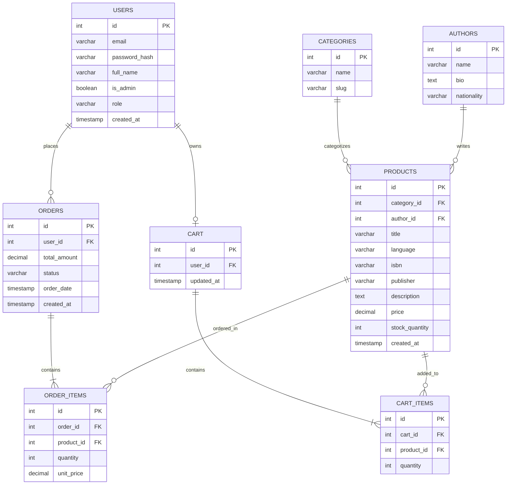

# Sprint 1: System Architecture & Scope Definition

**Project:** LitBridge — a bilingual (English & Urdu) marketplace for classic literature and philosophy.

**Author:** Maha Nadeem
**Roll No:** 2K23/CSM/62

## Why this idea?

I read a lot of classic and philosophical fiction (Dostoevsky, Kafka, Camus, Nietzsche), and I've noticed a real gap: if I want the English version of a book, it's either an expensive import or a random PDF, and if I want the Urdu translation, I have to dig through small local sellers on Instagram or WhatsApp groups with no proper catalog. There isn't one place where I can browse both. That's the problem LitBridge is trying to solve.

## 1. Target Audience & Market Focus

**Who it's for:** Someone like Zohaib — 20 to 30 years old, a student or young professional, who reads classic literature and philosophy and sometimes prefers reading in Urdu depending on the book and their mood that day.

**The problem:** English imports of these books are pricey and hard to find locally. Urdu translations exist, but they're scattered across sellers with no real catalog, no filtering, nothing organized. You basically can't compare both language editions of the same book in one place right now.

**Market:** Books — specifically classic literature and philosophy, sold in both English and Urdu.

## 2. MVP Feature Scope

| Category | Feature | Description | Priority |
|---|---|---|---|
| Authentication | User Registration & Login | Signup/login with hashed passwords and JWT sessions. | High (MVP) |
| Catalog | Book List & Search | Browse and filter books by author, genre, and language (English/Urdu). | High (MVP) |
| Catalog | Edition Selector | On a book's page, switch between its English and Urdu edition. | High (MVP) |
| Cart | Cart Management | Add, update, or remove items from a cart saved to your account. | High (MVP) |
| Checkout | Order Processing | Mock payment flow that creates an order from the cart. | High (MVP) |
| Admin | Inventory Control | Admin panel to add/edit books, stock, authors, categories. | Medium |
| Account | Order History | See your past orders and their status. | Medium |

**Not doing in MVP:** reviews/ratings, wishlists, recommendations, multiple sellers, real payment gateway. Keeping scope tight so it's actually finishable this semester.

## 3. Tech Stack Selection & Justification

- **Frontend: React (with Next.js)**
  I picked this mainly because SSR makes book pages load faster and rank better on search, which matters since people usually search for a book title directly. Also handles English (left-to-right) and Urdu (right-to-left) text without much extra work.

- **Backend: Node.js / Express**
  Same language as the frontend (JS), so it's easier for me to work across both without constantly switching mental models. Express is also lightweight enough that I'm not fighting the framework for a project this size.

- **Database: PostgreSQL**
  Orders and stock need to stay consistent — if someone buys a book, the stock count and the order record both need to update together, reliably. A relational DB with proper foreign keys handles that better than something schema-less. It also supports Urdu text (Unicode) without issues.

- **Caching: Redis (optional)**
  Mainly for session storage and caching catalog pages that don't change often, like a "Popular in Philosophy" list, so I'm not hitting Postgres for the same data repeatedly.

## 4. System Overview

```
[ React/Next.js frontend ]
        |
        |  API calls (HTTPS)
        v
[ Node.js / Express backend ]
        |
        |-- checks JWT for logged-in requests
        |
        |--------> PostgreSQL  (users, books, orders, cart)
        |--------> Redis       (sessions, cached catalog pages)
```

The frontend doesn't talk to the database directly — every request goes through the Express API first, which checks auth and handles the actual logic (like reducing stock when an order is placed).

## 5. Entity-Relationship Diagram (ERD)



### A few notes on the relationships

- A user can place many orders, but each order belongs to just one user. Each user also has exactly one cart.
- Books belong to one author and one category, but an author or category can have many books (1:N both ways).
- An order has to have at least one order item — you can't place an "empty" order. Same logic for cart items in a cart.
- I split `AUTHORS` into its own table instead of just a text field on `PRODUCTS`, so I can later show an author's bio/nationality without repeating that info on every single book.
- English and Urdu editions of the same book are stored as two separate rows in `PRODUCTS` (same `title`, different `language`) — that's what the Edition Selector switches between.
- `USERS.role` and `is_admin` together mark who can access the admin panel for inventory control.
